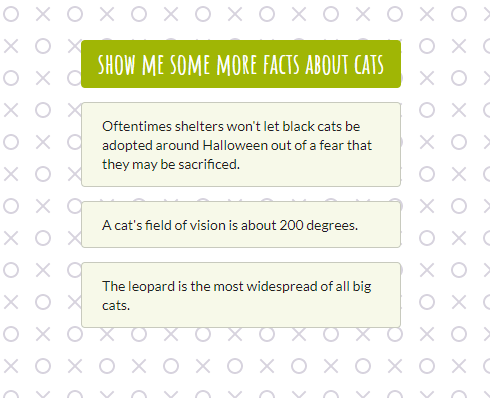

## Cat facts app

Practicing how to write:

-   integration tests to test React Redux apps.  
-   custom middlewares with Redux.  

Used cat-facts api (<https://alexwohlbruck.github.io/cat-facts/>) to get the data for my app.

#### App

#### Stack

-   react
-   react-dom
-   redux
-   react-redux
-   axios
-   jest
-   enzyme
-   enzyme-adapter-react-16
-   moxios
-   semantic ui
-   redux devTools extension
